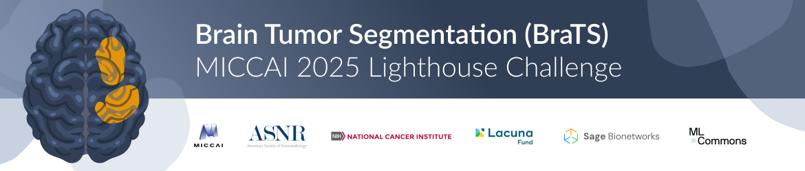

# 🧠 Brain Tumor Segmentation (BraTS)
<!-- ```
______         _____ _____
| ___ \       |_   _/  ___|
| |_/ /_ __ __ _| | \ `--.
| ___ \ '__/ _` | |  `--. \
| |_/ / | | (_| | | /\__/ /
\____/|_|  \__,_\_/ \____/
   
                                                                                                
``` -->


## Mission
**Advancing brain tumor care through collaborative AI and open science.**

Since 2012, BraTS has set the standard for brain tumor image analysis, driving progress by:
- Benchmarking innovative algorithms
- Providing high-quality, annotated datasets
- Fostering solutions to real clinical challenges

## BraTS 2025 Lighthouse Challenge
In partnership with leading organizations (such as AI-RANO, RSNA, ASNR, NIH, FDA, ASFNR, CBTN), BraTS 2025 expands its focus to:
- Longitudinal assessment of tumor response
- Generalizability of segmentation methods
- Inclusion of rare tumor entities with limited annotations
- Missing MRI (global) synthesis and inpainting (local synthesis)


🔗 [Learn more about the BraTS-Lighthouse 2025 Challenge](https://www.synapse.org/Synapse:syn64153130/wiki/630130)

## Access BraTS Algorithms
- [BraTS Orchestrator](https://github.com/BrainLesion/BraTS): Algorithms from 2023 onwards
- [BraTS Toolkit](https://github.com/neuronflow/BraTS-Toolkit): Legacy BraTS algorithms

## Resources & History
- [Past BraTS Challenges](https://www.synapse.org/Synapse:syn53708126/wiki/626320)
- [CBICA BraTS Hub](https://www.med.upenn.edu/cbica/brats/)

## Get Involved
- Participate in challenges and access datasets
- Contribute algorithms and research
- Connect with the global BraTS community

---
*Transforming brain tumor care through collaborative AI innovation since 2012.*
