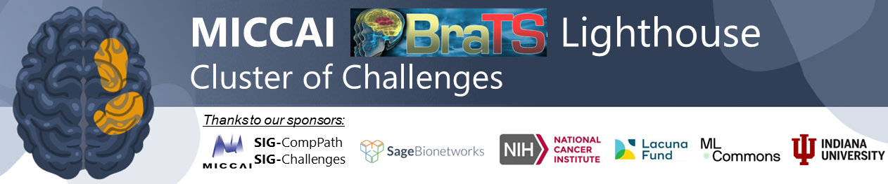

# 🧠 Brain Tumor Segmentation (BraTS)
<!-- ```
______         _____ _____
| ___ \       |_   _/  ___|
| |_/ /_ __ __ _| | \ `--.
| ___ \ '__/ _` | |  `--. \
| |_/ / | | (_| | | /\__/ /
\____/|_|  \__,_\_/ \____/
   
                                                                                                
``` -->

Since its inception at MICCAI 2012, BraTS has advanced brain tumor image analysis by benchmarking algorithmic advances, providing high-quality annotated datasets, and tasking participants with developing innovative solutions to clinically relevant problems along the disease course and across different brain tumor entities.
In collaboration with leading clinical organizations such as AI-RANO, RSNA, ASNR, NIH, FDA, ASFNR, and CBTN, the BraTS 2025 Lighthouse Challenge advances this effort by expanding its focus across further clinical needs. These include longitudinal assessment of brain tumor response, global and local synthesis of brain MRI,  generalizability of tumor segmentation methods across different entities, and inclusion of tumor entities for which there is currently limited annotated data.

Find more information on the [BraTS-Lighthouse 2025 Challenge website](https://www.synapse.org/Synapse:syn64153130/wiki/630130
).

## Access to BraTS algorithms
BraTS algorithms from 2023 onwards are available via [BraTS Orchestrator](https://github.com/BrainLesion/BraTS). [BraTS Toolkit](https://github.com/neuronflow/BraTS-Toolkit) provides legcacy BraTS algorithms.

## History
Some sources providing information about past years' BraTS challenges:
* https://www.synapse.org/Synapse:syn53708126/wiki/626320
* https://www.med.upenn.edu/cbica/brats/
